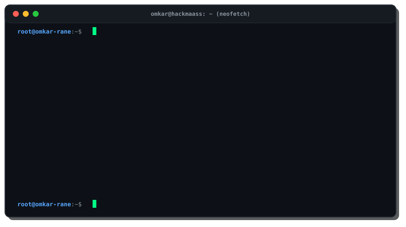

  
  

   

  <!-- Typing SVG: Terminal Protocol -->
  

   

 

### `>_ System.Identity`

  

---

### `>_ Classified Ops // Pinned & Flagship Repos`

| Sector | Operation / Repository | Debrief | Protocol / Stack |
| :--- | :--- | :--- | :---: |
| **🛡️ Sec & Systems** | [**`Diskman`**](https://github.com/Hackmaass/Diskman) | High-speed automated system cleaner & disk space reclaim utility. |  |
| **🛡️ Sec & Systems** | [**`CT-Flow`**](https://github.com/Hackmaass/CT-Flow) | Autonomous Cybersecurity Copilot for rapid threat triage & incident response. |  |
| **🤖 Agentic AI** | [**`Ada`**](https://github.com/Hackmaass/Ada) &nbsp;[*(Live Demo)*](https://ada-gules.vercel.app) | Adaptive Decision Agent framework for multi-step reasoning & autonomous execution. |  |
| **🤖 Agentic AI** | [**`Vector`**](https://github.com/Hackmaass/Vector) | RAG-based intelligent interview and automated technical evaluation platform. |  |
| **👁️ Vision & HCI** | [**`Signify_`**](https://github.com/Hackmaass/Signify_) | Real-time Computer Vision sign language translator & interactive tutoring engine. |   |
| **🌐 Web3 & DEX** | [**`Spectrav2`**](https://github.com/Hackmaass/Spectrav2) | High-fidelity platform with decentralized exchange, agentic wallet & NFT minting. |  |
| **💼 Enterprise** | [**`Karma`**](https://github.com/Hackmaass/Karma) &nbsp;[*(Live Demo)*](https://karma-pi-seven.vercel.app) | Modern enterprise workforce management & automated HR operations ecosystem. |  |
| **☁️ Cloud Ops** | [**`Lost-in-cloud`**](https://github.com/Hackmaass/Lost-in-cloud) | Distributed cloud experimentation & multi-tier deployment architecture. |  |

---

### `>_ The Arsenal // Tech Matrix`

**`>_ CORE LANGUAGES`** 

  

**`>_ FRAMEWORKS & FULL-STACK`** 

  

**`>_ AI, ML & SYSTEMS`** 

  

**`>_ DEVOPS, CLOUD & WEAPONS`** 

<!-- Quote Widget -->
  

---

### `>_ Encrypted Data // Live Telemetry`

  
  
   

  
  
  
   

  
  

---

### `>_ Secure Uplink`

  
  
  &nbsp;&nbsp;
  
  &nbsp;&nbsp;
  
  &nbsp;&nbsp;
  
  &nbsp;&nbsp;
  

    

  

